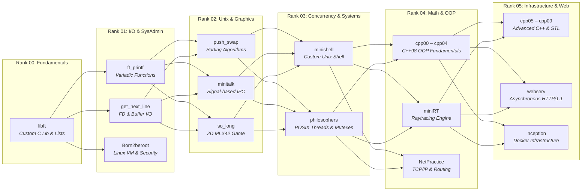

# 🌟 42 School — Common Core Journey

<div align="center">


<br/>

[](https://github.com/sklaokli/42-School/actions/workflows/norminette.yml)
[](https://github.com/sklaokli/42-School/actions/workflows/project-tester.yml)


</div>

---

## 📖 About

Welcome! I’m **sklaokli** ([@bababxxm](https://github.com/bababxxm)), a software engineering student at **42 Bangkok**.

**42** is an innovative, tuition-free, peer-driven, and teacher-free coding school. The curriculum centers on deep algorithmic problem-solving, low-level systems programming, operating system primitives, computer graphics, and networking.

This repository serves as a centralized monorepo showcasing my complete **42 Common Core** journey (Circles 00 through 05), documenting projects from fundamental C libraries up through complex multi-threaded concurrency, raytracing engines, and an asynchronous HTTP/1.1 web server from scratch.

---

## 🌐 The 42 Ecosystem & Environment

42 School challenges students to become autonomous problem-solvers through strict constraints, peer reviews, and automated verification:

### 📝 Norminette (The Coding Standard)

Almost every C project must strictly adhere to the **Norm** (enforced by `norminette`). This ensures code readability, modular design, and industry-grade standards:

- **25 lines maximum** per function (excluding curly braces).
- **80 columns maximum** per line.
- **4 parameters maximum** per function.
- **5 variable declarations maximum** per function (declared at top of block).
- **Strict prohibition** of `for`, `do...while`, `switch`, `case`, `goto`, and ternary operators.
- **No inline assignment** on variable declaration (unless `static` or `const`).
- Mandatory standard 42 file headers and prototypes.

### 🤖 Moulinette (Automated Evaluator)

**Moulinette** is 42's rigorous automated grading engine. Submissions undergo intensive testing:

- **Norm validation** ✅
- **Functional accuracy** against hidden test suites and edge cases 🛠️
- **Strict memory safety**: Zero memory leaks and zero invalid reads/writes (checked via Valgrind / AddressSanitizer) 💾
- **Crash resistance**: Immediate grade 0 if segmentation fault, bus error, or double-free occurs.

### 👥 Peer Evaluations & The Blackhole

- **Peer Defense**: Every project is defended in person before 2 to 3 peer evaluators who review code line-by-line, run edge-case tests, and verify conceptual comprehension.
- **Grades**: Scored from 0 to 125 (including bonus features).
- **The Blackhole**: A survival countdown timer. Passing projects awards days to keep your Blackhole counter positive.

---

## 🗺️ Curriculum Progression Roadmap

The 42 Common Core is structured as concentric circles (Ranks). Mastery of foundational primitives unlocks subsequent ranks:



---

## 📚 Curriculum Project Showcase

| Rank        | Project                                | Language / Tech     | Core Concepts & Engineering Learned                                                                                |
| :---------- | :------------------------------------- | :------------------ | :----------------------------------------------------------------------------------------------------------------- |
| **Rank 00** | [`libft`](./r00/libft)                 | C                   | Dynamic memory allocation, string manipulation, linked list data structures, unit test harness                     |
| **Rank 01** | [`Born2beroot`](./r01/Born2beroot)     | Linux, Bash         | Debian VM architecture, LVM partitioning, SSH hardening, UFW firewall, sudoers, cron daemon                        |
|             | [`ft_printf`](./r01/ft_printf)         | C                   | Variadic functions (`va_start`, `va_arg`), format string parsing, hex conversions                                  |
|             | [`get_next_line`](./r01/get_next_line) | C                   | Static variables, dynamic heap buffer management, reading from arbitrary file descriptors                          |
| **Rank 02** | [`minitalk`](./r02/minitalk)           | C (Unix Signals)    | Inter-Process Communication (IPC) via `SIGUSR1` and `SIGUSR2`, bit-shifting transmission                           |
|             | [`push_swap`](./r02/push_swap)         | C (Algorithms)      | Stack operations (`sa`, `pb`, `rr`, `rrr`), algorithmic complexity optimization, Butterfly sort                    |
|             | [`so_long`](./r02/so_long)             | C (MLX42 Graphics)  | Window management, 2D tile rendering, event handling, flood-fill map validation                                    |
| **Rank 03** | [`minishell`](./r03/minishell)         | C (Systems)         | Lexing, AST / command parsing, pipelines, redirections (`<`, `>`, `<<`, `>>`), signal trapping, built-ins          |
|             | [`philosophers`](./r03/philosophers)   | C (POSIX Threads)   | Concurrent programming, POSIX mutexes, race conditions, deadlock prevention, Dining Philosophers                   |
| **Rank 04** | [`cpp00` – `cpp04`](./r04/)            | C++98 (OOP)         | Canonical Form (orthodox), memory allocation (`new`/`delete`), inheritance, subtype polymorphism, abstract classes |
|             | [`miniRT`](./r04/miniRT)               | C (Graphics & Math) | Vector algebra, ray-object intersection (spheres, planes, cylinders), Phong reflection model, shadows              |
|             | [`NetPractice`](./r04/NetPractice)     | Networking          | IPv4 addressing, subnet masks (CIDR), routing tables, switch/router configurations                                 |
| **Rank 05** | [`cpp05` – `cpp09`](./r05/)            | C++98 (Advanced)    | Exception handling, C++ casts (`static_cast`, `dynamic_cast`), templates, STL algorithms, Ford-Johnson sort        |
|             | [`inception`](./r05/inception)         | Docker, SysAdmin    | Multi-container microservices (NGINX, WordPress, MariaDB) with Docker Compose, TLSv1.3, persistent volumes         |
|             | [`webserv`](./r05/webserv)             | C++98 (Networking)  | Non-blocking I/O multiplexing (`poll`/`epoll`/`kqueue`), RFC 7230 HTTP/1.1 parser, CGI execution engine            |

---

## 🗂️ Repository Architecture

```text
42-School/
├── r00/
│   └── libft/                 # Custom libc & data structures
├── r01/
│   ├── Born2beroot/           # VM setup documentation & monitoring script
│   ├── ft_printf/             # Reimplementation of printf
│   └── get_next_line/         # Reading lines from file descriptors
├── r02/
│   ├── minitalk/              # Signal-based IPC client-server
│   ├── push_swap/             # Stack sorting algorithm (trials & optimization)
│   └── so_long/               # 2D game using MLX42
├── r03/
│   ├── minishell/             # Custom UNIX shell implementation
│   └── philosophers/          # Multithreading concurrency simulation
├── r04/
│   ├── cpp00/ – cpp04/        # C++ Object-Oriented Programming modules
│   ├── miniRT/                # Raytracer rendering 3D geometric shapes
│   └── NetPractice/           # Network configuration exercises
└── r05/
    ├── cpp05/ – cpp09/        # Advanced C++ (Exceptions, Templates, STL)
    ├── inception/             # Docker Compose LEMP infrastructure
    └── webserv/               # Asynchronous HTTP/1.1 web server
```

---

## 🛠️ Monorepo Developer Console & Tooling

This repository includes a custom, unified root [`Makefile`](./Makefile) equipped with automated testing, memory safety auditing, and submission pipelines.

```text
=== 42-School Monorepo Management Console ===

Monorepo Git Operations:
  make push                   Push entire monorepo to GitHub
  make pull                   Pull latest changes for monorepo
  make status (or make st)    Show repository working status
  make backup                 Create a timestamped backup of the .git directory

Quality & 42 Intra Submission Tooling:
  make setup-hooks            Install Git hooks (Norminette, commit-msg, artifact guards)
  make submit PROJECT=<name>  Automated pre-flight checks, fclean, and subtree push to 42 Intra

Workspace Maintenance & Testing:
  make test PROJECT=<name>    Run automated unit tests (e.g. make test PROJECT=libft)
  make sanitize PROJECT=<name> Compile & run tests with AddressSanitizer & UBSan
  make valgrind PROJECT=<name> Run Valgrind full leak check (zero-tolerance exit code)
  make clean-all              Run clean in all subprojects
  make fclean-all             Run fclean in all subprojects
  make norm                   Run Norminette across all projects
```

### ⚡ Quick Usage Examples

#### 1. Zero-Leak Memory Safety Verification

Audit dynamic memory allocation and ensure 0 leaks before an evaluation:

```bash
# Compile and test with AddressSanitizer (detects out-of-bounds, heap overflow, use-after-free)
make sanitize PROJECT=libft

# Run full Valgrind Memcheck (zero lost blocks required)
make valgrind PROJECT=libft
```

#### 2. Automated 42 Intra Submission (`make submit`)

Deploy any project directly to your 42 Vogsphere evaluation repository without manual git subtree hassle:

```bash
make submit PROJECT=push_swap REMOTE=git@vogsphere.42bangkok.com:vogsphere/intra-uuid-...
```

> **Pre-flight Quality Gate:** The pipeline automatically verifies 0 Norminette errors, runs automated tests, runs `fclean`, and performs a clean `git subtree push`.

#### 3. Installing Local Git Hooks

```bash
make setup-hooks
```

Activates:

- **`pre-commit`**: Blocks accidental commits of compiled `.o`/binary objects and auto-runs Norminette on staged `.c`/`.h` files.
- **`commit-msg`**: Enforces industry-standard [Conventional Commits](https://www.conventionalcommits.org/) (`feat:`, `fix:`, `test:`, `refactor:`, etc.).

#### 4. Compiling Individual Projects

```bash
# C Project
cd r02/so_long && make

# C++ Exercise
cd r04/cpp00/ex00 && make

# Monorepo-wide Norminette check
make norm
```

---

## 🛡️ 42 Engineering Standards & Quality Gates

Every project in this repository satisfies the stringent requirements of 42 School:

1. **The Norm (Norminette v3 Compliance)**
   - Strict 25-line limit per function.
   - Max 4 arguments and 5 local variables per function.
   - No `for`, `do-while`, `switch`, `case`, `goto`, or ternary operators.
   - Standard 42 headers on all source files.

2. **Memory Safety & Reliability**
   - Zero memory leaks: All dynamically allocated memory (`malloc`, `calloc`, `new`) is completely freed upon exit.
   - Zero undefined behavior: No pointer arithmetic overflows, uninitialized memory reads, or double frees.
   - Clean compilation: Built strictly with `-Wall -Wextra -Werror`.

3. **C++98 Standard Adherence**
   - Modules `cpp00` through `cpp09` and `webserv` adhere strictly to the **C++98 standard** (`-std=c++98 -pedantic`).
   - Implementation of Orthodox Canonical Form (Default Constructor, Copy Constructor, Copy Assignment Operator, Destructor).

---

## 👤 Author

- **Sorawit Klaokliang** (`sklaokli`)
- Student at **42 Bangkok**
- GitHub: [@sklaokli](https://github.com/sklaokli)
